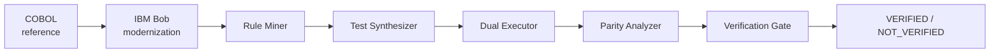

# CBLDiff

## What CBLDiff is

CBLDiff is a behavioral parity verification workflow for AI-assisted modernization of legacy COBOL programs. The project takes a COBOL payroll reference implementation, modernizes it into Java with IBM Bob, then verifies that the Java behavior matches the COBOL behavior across a deterministic test suite and rule-level provenance trace.

The goal is not just to compare source code text. The goal is to prove that the business behavior survived the modernization, even when the implementation details differ.

## The COBOL modernization verification problem

AI-generated modernization can introduce subtle semantic drift that is easy to miss in code review and difficult to detect with a textual diff. In payroll logic, the difference between a boundary condition such as "gross <= 1500.00" and "gross < 1500.00" can affect tax calculations, net pay, and the final verification verdict.

This is exactly the kind of issue that matters in enterprise systems: the implementation may look plausible, but business rules are violated. CBLDiff closes that gap by running both versions against the same deterministic inputs and comparing the results execution by execution.

## How IBM Bob is used

IBM Bob is used as the modernization and orchestration layer. The workflow starts from the original COBOL source and then runs through the Bob-based modernization path before being verified by the CBLDiff engine.

The repository includes the Bob integration assets that make this reusable and inspectable:

- [.bob/custom_modes.yaml](.bob/custom_modes.yaml)
- [.bob/mcp.json](.bob/mcp.json)
- [.bob/skills/parity-check/SKILL.md](.bob/skills/parity-check/SKILL.md)

The key idea is that Bob can invoke a parity-check skill and the local MCP server, which then executes the existing CBLDiff verification flow and returns a structured result.

## Current verified state

| Metric | Result |
|---|---:|
| Extracted business rules | 15 |
| Deterministic tests | 70 |
| Matching tests | 70/70 |
| Divergent tests | 0 |
| Parity score | 1.000000 |
| Parity percentage | 100.00% |
| Critical divergence | No |
| Critical gate | PASS |
| Final status | VERIFIED |

This is the current source-of-truth state for the repository. The repaired Java implementation is the final verification target.

## CBLDiff workflow



The implemented sequence is:

1. COBOL reference implementation
2. IBM Bob modernization
3. Rule Miner
4. Test Synthesizer
5. Dual Executor
6. Parity Analyzer
7. Verification Gate

## Business rules and test suite

The rule miner extracts 15 business rules from the COBOL payroll logic, including federal tax brackets, overtime calculation, dependent allowance, Social Security caps, Medicare, and validation rules.

The synthesized deterministic suite contains 70 tests that exercise normal flow, boundary conditions, error conditions, interactions, and adversarial cases. These tests are stored in [data/test_inputs.json](data/test_inputs.json) and the extracted rule definitions are in [data/rules.json](data/rules.json).

## Baseline verification result

The repository is configured to reflect the repaired Java implementation as the final source of truth.

The baseline verification result is:

- Matching tests: 70/70
- Divergent tests: 0
- Parity score: 1.000000
- Final status: VERIFIED

This result is captured in [data/verification_result.json](data/verification_result.json), with the execution summary in [data/execution_summary.json](data/execution_summary.json).

## Intentional boundary regression and detection

CBLDiff includes a historical regression-detection walkthrough that is useful for demonstrating why the verification gate exists.

During the regression scenario, the Java implementation was mutated so that the federal bracket boundary behaved as:

```text
gross < 1500.00
```

instead of the correct COBOL behavior:

```text
gross <= 1500.00
```

This is the critical RULE-05 boundary for the second federal tax bracket. The affected condition is the $1500 boundary example described by the payroll rules.

The regression was detected by the verification system because the exact boundary value $1500.00 produced a tax mismatch. The resulting failure was surfaced as:

- Rule: RULE-05
- Test IDs: BND-006, BND-007, ITR-005
- Affected fields: federal_tax, net_pay
- Final status: NOT_VERIFIED
- Parity score: 95.71%

This is captured in the divergence artifacts and demonstrates the critical-role gate in action.

## RULE-05 and the $1500 boundary example

RULE-05 governs the second federal tax bracket:

- gross > 500.00
- gross <= 1500.00
- applies a 12% federal tax rate

The exact boundary condition in the repaired Java implementation is:

```java
if (gross.compareTo(BRACKET_2_LIMIT) <= 0) {
```

This condition is present in [java/PayrollProcessor.java](java/PayrollProcessor.java) and is the final accepted logic. It preserves the COBOL reference behavior and ensures that gross = 1500.00 remains inside the bracket, rather than falling into the next bracket.

## NOT_VERIFIED result during regression

The historical regression case is important because it proves the gate does not silently pass incorrect modernizations. When the Java code was intentionally mutated, the pairwise execution comparison found a critical divergence and the final verdict changed to NOT_VERIFIED.

This came from the same verification pipeline used in the final state, but with the incorrect condition active. The purpose was to validate that the system could detect a real rule violation and block verification.

## Repair of the Java implementation

The Java implementation was repaired by restoring the inclusive upper-bound logic for the second tax bracket. The final implementation remains the source of truth and is not intentionally regressed again.

The repair is specifically validated in [java/PayrollProcessor.java](java/PayrollProcessor.java), where the second bracket condition is inclusive and matches the COBOL rule semantics.

## Final VERIFIED result

After the repair, the final verification run confirms:

- 70 total tests
- 70 matching
- 0 divergent
- parity score 1.000000
- 100.00% parity
- critical divergence: no
- critical gate: PASS
- final status: VERIFIED

This is the accepted final state of the repository.

## Bob Skill, custom mode, and MCP integration

The repository includes a reusable Bob verification layer:

- [.bob/custom_modes.yaml](.bob/custom_modes.yaml): defines the CBLDiff Verify custom mode
- [.bob/mcp.json](.bob/mcp.json): configures the local MCP server
- [.bob/skills/parity-check/SKILL.md](.bob/skills/parity-check/SKILL.md): defines how Bob invokes parity verification

The flow is:

1. Bob calls the parity-check skill.
2. The skill invokes the local MCP server.
3. The MCP tool executes the existing parity analysis pipeline.
4. The tool returns structured verification results to Bob.
5. The final status is reported as VERIFIED or NOT_VERIFIED.

This keeps the verification logic centralized in the repository instead of duplicating it in Bob-specific code.

## Verification Evidence

The current repository includes the evidence artifacts produced by the verification pipeline.

- [data/verification_result.json](data/verification_result.json) — final verdict and parity metrics
- [data/execution_summary.json](data/execution_summary.json) — aggregate execution counts
- [data/divergence_report.json](data/divergence_report.json) — detailed divergence analysis and rule provenance
- [data/cobol_outputs.json](data/cobol_outputs.json) — COBOL execution outputs
- [data/java_outputs.json](data/java_outputs.json) — Java execution outputs

### Screenshot and demo evidence

The repository includes session evidence and screenshots that document the workflow and verification history:

- [bob_sessions/01-bob-skill-mcp.png](bob_sessions/01-bob-skill-mcp.png)
- [bob_sessions/02-phase9-repair-progress.png](bob_sessions/02-phase9-repair-progress.png)
- [bob_sessions/03-phase9-boundary-checks.png](bob_sessions/03-phase9-boundary-checks.png)
- [bob_sessions/04-phase6-parity-verification.png](bob_sessions/04-phase6-parity-verification.png)

### Evidence note

No fake demo screenshots or fabricated benchmarks are included. The verification evidence in this repository is based on the generated artifact files and session captures that are actually present in the project.

## Reproducibility commands

From the repository root:

```bash
python cbldiff/dual_executor.py
python cbldiff/parity_analyzer.py
```

The expected final result is:

```text
Total Tests: 70
Matching: 70
Divergent: 0
Parity Score: 1.000000
Status: VERIFIED
```

## Repository structure

```text
.
├── README.md
├── .bob/
│   ├── custom_modes.yaml
│   ├── mcp.json
│   └── skills/
│       └── parity-check/
│           └── SKILL.md
├── bob_sessions/
│   ├── bob-task-history-2026-08-28.json
│   ├── bob-task-history-2026-08-28.md
│   ├── phase5-6-cbldiff-analysis.md
│   ├── phase8-bob-skill-mcp.md
│   ├── phase8-integration-notes.md
│   ├── phase9-repair-final-reverification.md
│   └── *.png
├── cbldiff/
│   ├── __init__.py
│   ├── dual_executor.py
│   ├── parity_analyzer.py
│   ├── rule_miner.py
│   └── test_synthesizer.py
├── cobol/
│   ├── IO_CONTRACT.md
│   ├── payroll.cbl
│   ├── quicktest.sh
│   ├── sample_inputs.txt
│   └── smoke_test.sh
├── data/
│   ├── cobol_outputs.json
│   ├── divergence_report.json
│   ├── execution_summary.json
│   ├── java_outputs.json
│   ├── rules.json
│   ├── test_inputs.json
│   └── verification_result.json
├── java/
│   ├── PayrollBatchRunner.java
│   ├── PayrollProcessor.java
│   ├── compare.sh
│   ├── run.sh
│   └── PayrollProcessor.class
├── reports/
└── .gitignore
```

## Final project position

CBLDiff is a verification-oriented modernization workflow: it does not replace the COBOL reference implementation, it does not mutate the rule set or test inputs, and it does not hide regressions behind a passing aggregate. The pipeline is designed to surface exact behavior and provenance, then only report VERIFIED when the parity gate and critical-rule gate both pass.

That is the current state of this repository and the basis for the final hackathon submission.
