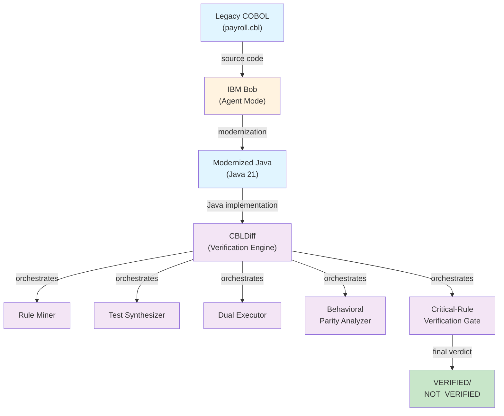
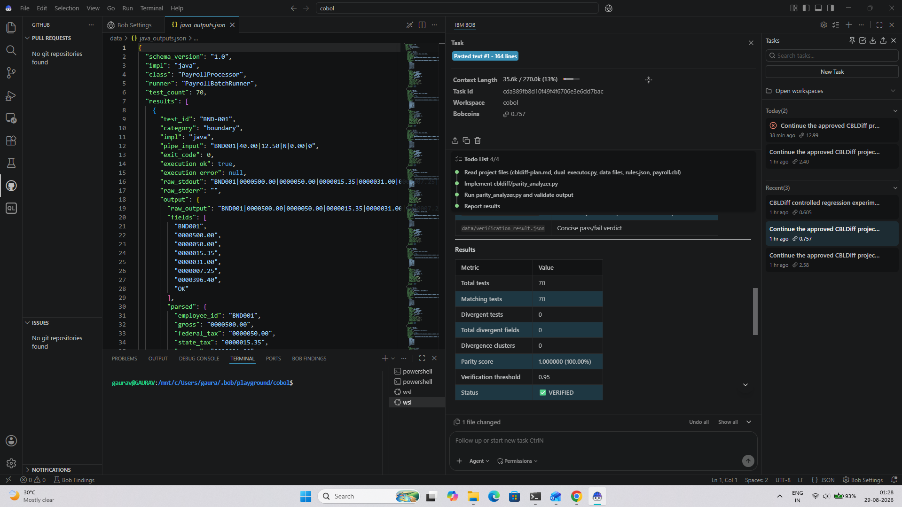
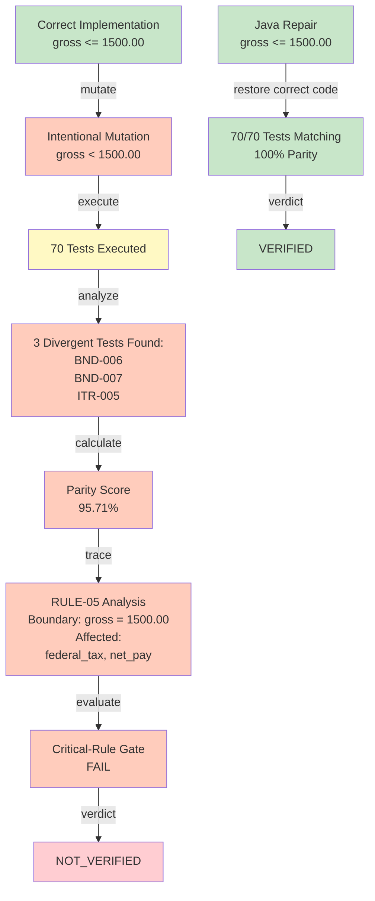
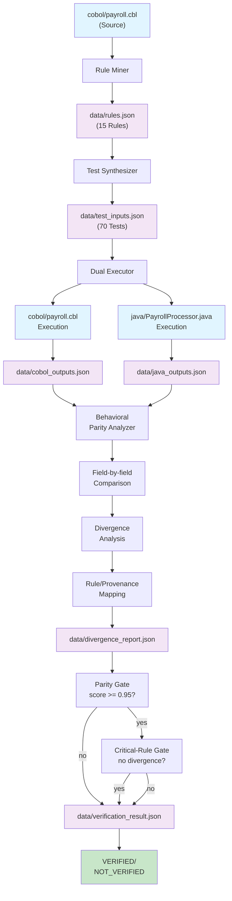
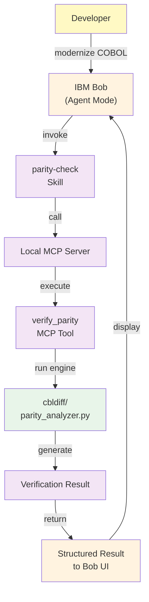
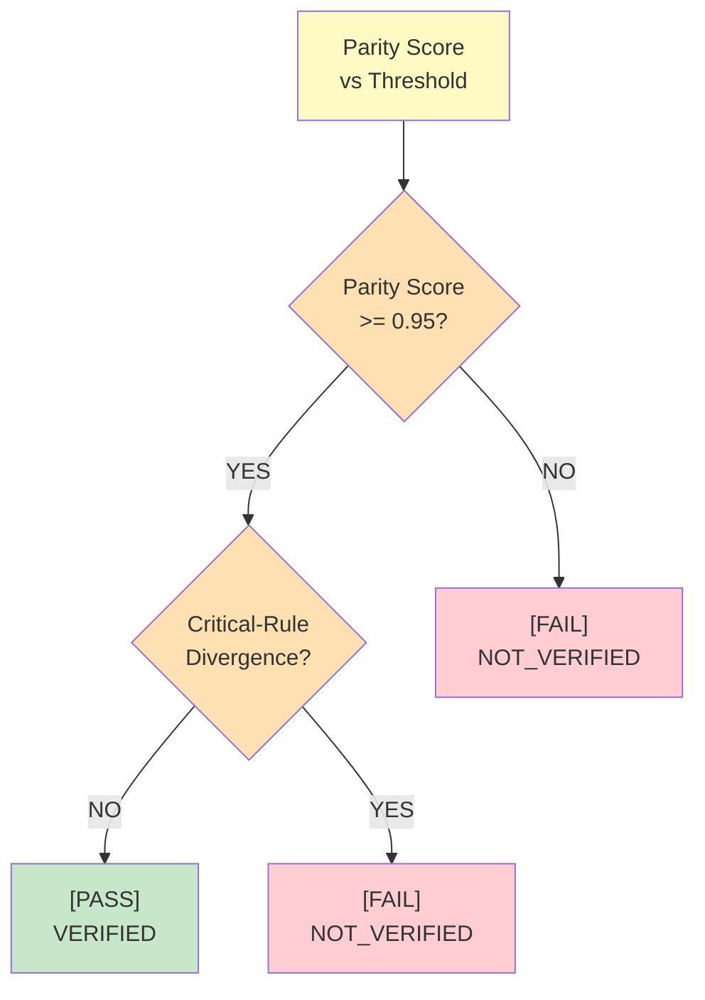
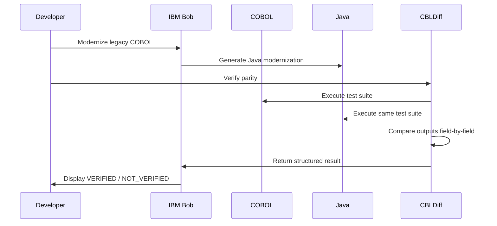

# CBLDiff

## Behavioral Parity Verification for AI-Modernized COBOL

**"AI can modernize legacy code. CBLDiff verifies that the behavior survived."**

### The Problem

When AI modernizes legacy COBOL into modern languages like Java, textual code comparison is insufficient to prove behavioral equivalence. Two implementations may be structurally different but functionally identical—or worse, subtly different in ways that break critical business rules. Traditional diffs cannot detect these behavioral divergences.

### The Solution

CBLDiff executes the original COBOL and modernized Java against the **same deterministic test suite**, captures their outputs, and compares their behavior **execution-by-execution**. Any divergence is detected, analyzed by rule, and reported with full traceability.

### High-Level Workflow



---

## Key Results

| Metric | Value |
|--------|-------|
| Business Rules Extracted | 15 |
| Deterministic Test Cases | 70 |
| Final Baseline: Matching Tests | 70/70 |
| Final Baseline: Divergent Tests | 0 |
| **Behavioral Parity** | **100% VERIFIED** |

### Verification Evidence



**Figure 1:** Final verification result from IBM Bob integration showing 70/70 matching tests, 0 divergent tests, and [PASS] VERIFIED status.

---

## Controlled Regression Demonstration

CBLDiff demonstrates its detection capability through a controlled regression test:

### Baseline State
- **Condition:** `gross <= 1500.00`
- **Result:** 70/70 tests matching, 100% parity, VERIFIED

### Injected Regression

A controlled regression changed the Java federal-tax boundary from:

```diff
- gross <= 1500.00
+ gross < 1500.00
```

**Critical Boundary Tested:** `gross = 1500.00`

### Regression Detection Results

The mutation caused 3 divergent test cases:

| Test ID | Category | Details |
|---------|----------|---------|
| BND-006 | Boundary | gross exactly at 1500.00 |
| BND-007 | Boundary | gross at 1500.00 edge case |
| ITR-005 | Interaction | Rule-05 interaction with other tax rules |

**Verification Impact:**
- Matching Tests: 67/70
- Divergent Tests: 3
- Parity Score: 95.71%
- Affected Rule: RULE-05 (Federal tax bracket boundary)
- Affected Fields: federal_tax, net_pay
- **Final Status: NOT_VERIFIED**

### Post-Repair Verification
After correcting the Java implementation back to the original logic (`gross <= 1500.00`):
- **Matching Tests:** 70/70
- **Divergent Tests:** 0
- **Parity:** 100%
- **Status:** [PASS] **VERIFIED**

This demonstrates CBLDiff's ability to detect behavioral regressions and validate repairs.

### Regression Detection Workflow



---

## How CBLDiff Works

CBLDiff is a 5-stage verification pipeline:

1. **Rule Miner**  
   Analyzes COBOL source code to extract business rules and logical conditions.

2. **Test Synthesizer**  
   Generates deterministic test cases that exercise all extracted rules and boundary conditions.

3. **Dual Executor**  
   Executes both the original COBOL and modernized Java with identical inputs; captures and normalizes outputs.

4. **Behavioral Parity Analyzer**  
   Compares execution results test-by-test and rule-by-rule; identifies divergences and their root causes.

5. **Critical-Rule Verification Gate**  
   Applies pass/fail logic based on divergence threshold; outputs final verification status.

### Detailed Verification Pipeline



---

## IBM Bob Integration

CBLDiff is integrated with **IBM Bob**, an AI agent platform for enterprise code transformation. Bob orchestrates the modernization and verification workflow:

### IBM Bob Integration Architecture



**Integration Components:**
- **Bob Mode:** Plan & Agent modes
- **Skill:** `parity-check` (embedded in workspace)
- **Server:** Local Model Context Protocol (MCP) server
- **Tool:** `verify_parity` MCP tool
- **Custom Mode:** `CBLDiff Verify`

### Integration Files
- [.bob/mcp.json](.bob/mcp.json) — MCP server configuration
- [.bob/custom_modes.yaml](.bob/custom_modes.yaml) — Custom verification mode
- [.bob/skills/parity-check/SKILL.md](.bob/skills/parity-check/SKILL.md) — Parity check skill definition

---

## Verification Data & Artifacts

| Artifact | Purpose |
|----------|---------|
| [data/rules.json](data/rules.json) | Extracted business rules (15 rules) |
| [data/test_inputs.json](data/test_inputs.json) | Synthesized test cases (70 tests) |
| [data/execution_summary.json](data/execution_summary.json) | Execution results summary |
| [data/divergence_report.json](data/divergence_report.json) | Divergence analysis by rule |
| [data/verification_result.json](data/verification_result.json) | Final verification verdict |

### Verification Decision Logic



**Verification Decision:**
- **VERIFIED:** Parity score >= 0.95 AND no critical-rule divergence
- **NOT_VERIFIED:** Parity score < 0.95 OR critical-rule divergence detected

---

## Bob Development Evidence

The repository contains comprehensive session records and evidence from IBM Bob integration development:

- [bob_sessions/bob-task-history-2026-08-28.md](bob_sessions/bob-task-history-2026-08-28.md) — Detailed task history
- [bob_sessions/phase8-bob-skill-mcp.md](bob_sessions/phase8-bob-skill-mcp.md) — Skill & MCP integration documentation
- [bob_sessions/phase8-integration-notes.md](bob_sessions/phase8-integration-notes.md) — Integration notes and learnings
- [bob_sessions/phase9-repair-final-reverification.md](bob_sessions/phase9-repair-final-reverification.md) — Regression repair and re-verification
- [bob_sessions/01-bob-skill-mcp.png](bob_sessions/01-bob-skill-mcp.png) — Skill execution screenshot
- [bob_sessions/02-phase9-repair-progress.png](bob_sessions/02-phase9-repair-progress.png) — Repair progress screenshot
- [bob_sessions/03-phase9-boundary-checks.png](bob_sessions/03-phase9-boundary-checks.png) — Boundary validation screenshot
- [bob_sessions/04-phase6-parity-verification.png](bob_sessions/04-phase6-parity-verification.png) — Parity verification screenshot

---

## Demo: Baseline -> Regression -> Detection -> Repair -> Verification

1. **Baseline Verification**  
   Execute original COBOL and Java; confirm 100% behavioral parity across 70 tests.

2. **Controlled Regression**  
   Inject a boundary condition error in Java (`gross < 1500.00` instead of `gross <= 1500.00`).

3. **Divergence Detection**  
   CBLDiff identifies 3 failing tests (BND-006, BND-007, ITR-005) affecting RULE-05; parity drops to 95.71%.

4. **Repair**  
   Correct the Java condition back to the original logic.

5. **Re-Verification**  
   Re-run CBLDiff; confirm 70/70 tests passing, 100% parity restored, status: VERIFIED.

This end-to-end cycle demonstrates CBLDiff's ability to catch behavioral regressions and validate corrections.

---

## Why CBLDiff is Different

| Approach | Limitation |
|----------|-----------|
| **Textual Code Diff** | Cannot detect behavioral equivalence; may miss subtle semantic differences |
| **Unit Testing** | Depends on test coverage; does not guarantee rule preservation across all inputs |
| **Abstract Interpretation** | Computationally expensive; difficult to trace to business rules |
| **CBLDiff (Behavioral Parity)** | **Deterministic test execution** + **rule-level traceability** = provable behavioral equivalence over test suite |

---

## AI/ML Relevance

CBLDiff employs deterministic, rule-based verification with full explainability:

- **Rule Mining:** Deterministic static analysis of COBOL source code.
- **Test Synthesis:** Deterministic generation of test cases using boundary value analysis.
- **Parity Analysis:** Deterministic comparison of execution results.
- **Explainability & Provenance:** Every divergence is traced to a specific rule and test case; results are fully auditable.

**Note on ML:** CBLDiff's core verification engine is rule-based and deterministic. ML/clustering techniques were intentionally deferred as future work when the baseline achieved 100% parity with zero divergences. ML could support advanced anomaly detection or pattern discovery but is not currently the primary verification mechanism.

---

## Repository Structure

```
cbldiff/
├── README.md                          # This file
├── cbldiff/                           # Core verification engine
│   ├── __init__.py
│   ├── dual_executor.py               # COBOL + Java dual execution
│   ├── parity_analyzer.py             # Behavioral comparison logic
│   ├── rule_miner.py                  # Business rule extraction
│   └── test_synthesizer.py            # Deterministic test generation
├── cobol/
│   ├── payroll.cbl                    # Original COBOL payroll processor
│   ├── IO_CONTRACT.md                 # Input/output contract specification
│   ├── sample_inputs.txt              # Sample test inputs
│   ├── smoke_test.sh                  # Quick smoke test
│   └── quicktest.sh                   # Minimal test script
├── java/
│   ├── PayrollProcessor.java          # Modernized Java implementation
│   ├── PayrollBatchRunner.java        # Batch test runner
│   ├── run.sh                         # Execution script
│   └── compare.sh                     # Comparison script
├── data/                              # Verification artifacts
│   ├── rules.json                     # Extracted business rules
│   ├── test_inputs.json               # Test case definitions
│   ├── java_outputs.json              # Java execution results
│   ├── cobol_outputs.json             # COBOL execution results
│   ├── execution_summary.json         # Summary statistics
│   ├── divergence_report.json         # Detailed divergence analysis
│   └── verification_result.json       # Final verification verdict
├── .bob/                              # IBM Bob integration
│   ├── mcp.json                       # MCP server configuration
│   ├── custom_modes.yaml              # Custom CBLDiff verification mode
│   └── skills/parity-check/SKILL.md   # Parity check skill
├── bob_sessions/                      # Development evidence & session logs
│   ├── bob-task-history-2026-08-28.md
│   ├── phase8-bob-skill-mcp.md
│   ├── phase8-integration-notes.md
│   ├── phase9-repair-final-reverification.md
│   └── *.png                          # Session screenshots
└── reports/                           # Generated reports
```

---

## Test Coverage

CBLDiff synthesizes 70 deterministic test cases across five categories to achieve comprehensive rule coverage:

| Test Category | Count | Purpose |
|---------------|-------|---------|
| **Boundary** | 20 | Test rule boundary conditions (e.g., gross = 1500.00) |
| **Normal** | 16 | Exercise standard business logic paths |
| **Error** | 8 | Validate error handling and edge cases |
| **Interaction** | 16 | Test rule combinations and dependencies |
| **Adversarial** | 10 | Challenge edge cases with extreme values |
| **TOTAL** | **70** | **Full rule coverage** |

Each test case exercises one or more of the 15 extracted business rules and generates structured provenance data to trace divergences back to specific rules.

---

## Running the Project

### Developer Workflow



This workflow ensures developers can validate behavioral equivalence after AI-driven modernization before deploying to production.

### Environment
- **OS:** Ubuntu 20.04+ (WSL2 on Windows)
- **GnuCOBOL:** 3.2.0
- **Java:** 21+
- **Python:** 3.14+
- **Git**

### Prerequisites
```bash
# Install GnuCOBOL
sudo apt-get install gnucobol

# Install Java 21
sudo apt-get install openjdk-21-jdk

# Install Python dependencies
pip install -r requirements.txt  # (if present in repo)
```

### Verify Behavioral Parity
```bash
cd /home/gaurav/cbldiff

# Run COBOL execution
cd cobol && ./quicktest.sh
cd ..

# Run Java execution
cd java && ./run.sh
cd ..

# Run parity analysis
python3 -m cbldiff.parity_analyzer
```

### Expected Output
```
Execution Summary:
  Total Tests: 70
  Matching: 70
  Divergent: 0
  Parity: 100.00%
Status: VERIFIED
```

### With IBM Bob
CBLDiff can also be invoked through IBM Bob using the embedded `parity-check` skill:
1. Open the project in IBM Bob (Agent Mode)
2. Run the `CBLDiff Verify` custom mode
3. Bob will execute the verification and report the result

---

## Limitations

CBLDiff provides **behavioral equivalence verification over the generated test suite**. It does **not**:

- Mathematically prove complete program equivalence for every possible input
- Replace formal methods or theorem provers
- Handle non-deterministic or stateful operations (I/O, system time, randomness)
- Verify performance characteristics or resource consumption

Verification is limited to the coverage of the test suite. Additional rules, boundary conditions, or edge cases may require synthetic test expansion.

---

## Project Goal

**CBLDiff demonstrates that behavioral verification through deterministic dual execution is a practical, explainable, and auditable method for validating AI-modernized legacy code.**

By combining rule extraction, test synthesis, dual execution, and behavioral comparison, CBLDiff provides confidence that modernized code preserves the original business behavior—essential for enterprise COBOL-to-Java transformations where correctness is non-negotiable.

---

## Repository

**GitHub:** [happy2234/CBLDiff](https://github.com/happy2234/CBLDiff)

---

*CBLDiff was developed as a submission for the IBM TechXchange 2026 Hackathon.*
